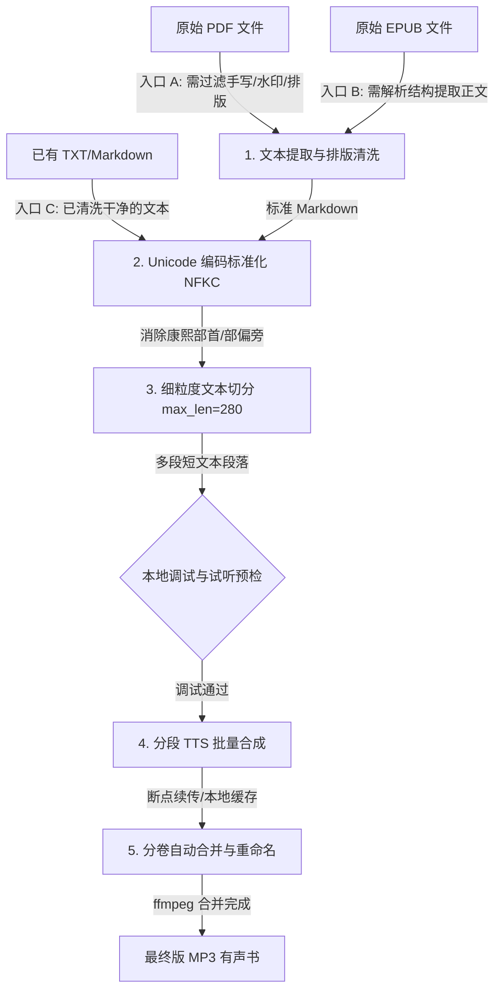

# 🎧 Text-to-Audiobook Skill

[](https://github.com/lssuzie/text-to-audiobook/stargazers)
[](https://github.com/lssuzie/text-to-audiobook/network)
[](https://skills.sh)

[中文说明](#-中文说明) | [English Guide](#-english-guide)

---

## 🇨🇳 中文说明

一个为 AI Coding Agents（如 Claude Code、Cursor、Gemini CLI 等）设计的、专注于**高保真有声书合成**的模块化技能。它通过消除手写批注/水印干扰、净化 Unicode 偏旁读音、以及应用注意力防漂音切片算法，将多种格式的文档清洗并转换为媲美专业播音品质的音频项目。

> 「将嘈杂的文字，还原为纯净的声线。」

### 🚀 快速开始

在您的项目工作区终端中直接运行以下命令，即可一键下载并安装此 Skill：

```bash
npx skills add lssuzie/text-to-audiobook
```

### 🛠️ 核心黑科技

普通的文本转语音（TTS）在长文本和复杂排版下极易崩溃。本 Skill 集成了以下核心解决方案：

1. **防音质退化与语速失控 (280字切片)**
   * **痛点**：TTS 在单次合成超长文本时，注意力累积误差会在中后期呈指数级上升，产生飘音、电音扭曲、越读越快和吞字等问题。
   * **方案**：将文本严格限制在 `280` 字以内分段（零样本声音克隆下限制在 `75-105` 字），保证模型始终在最稳定状态下推理。
2. **根治发音与声调错乱 (NFKC 兼容性标准化)**
   * **痛点**：PDF 或 OCR 导出的文档中，许多汉字会被映射到“康熙部首”字符集而非标准 CJK 汉字集，虽然视觉相同但会使 TTS 误读或跑调。
   * **方案**：引入 `unicodedata.normalize("NFKC", text)`，自动纠正所有偏旁部首码点为标准汉字。
3. **输入格式解耦 (多格式支持)**
   * 支持 **PDF、TXT、EPUB、Markdown** 多种入口。如果已有清洗好的文本，可直接跳过第一阶段的提取清洗，直达语音生成。

### 🗺️ 工作流架构



### 📂 技能目录结构

```
text-to-audiobook/
├── SKILL.md                 # 技能定义与 Agent 指引
├── README.md                # 本说明文档
├── scripts/                 # 可执行调试与处理脚本
│   ├── extract_to_markdown.py   # PDF 字体过滤与提取
│   ├── generate_audio.py        # 批量 TTS 音频请求
│   ├── merge_existing.py        # ffmpeg 音频段落合并
│   └── rename_volumes.py        # 章节智能重命名
└── references/              # 渐进式披露详细设计规范
    ├── debugging.md             # 本地预检与试听（Dry-run）指南
    ├── mimo_api.md              # MiMo TTS 接口 Payload 示例
    ├── voice_clone.md           # 零样本克隆调优规范
    └── troubleshooting.md        # 代理与 ffmpeg 常见错误排查
```

---

## 🇺🇸 English Guide

A modular skill designed for AI Coding Agents (such as Claude Code, Cursor, Gemini CLI, etc.), specializing in **high-fidelity audiobook synthesis**. It cleans and converts various document formats into professional broadcast-quality audio projects by filtering handwritten notes/watermarks, correcting corrupted CJK Unicode pronunciations, and applying an attention-drift prevention slicing algorithm.

> "Restoring noisy text back to pure vocal lines."

### 🚀 Quick Start

Run the following command in your project workspace terminal to download and install this Skill:

```bash
npx skills add lssuzie/text-to-audiobook
```

### 🛠️ Key Technical Features

Standard Text-to-Speech (TTS) processes easily degrade on long texts and complex layouts. This Skill integrates the following core solutions:

1. **Anti-Drift Slicing (280-Character Token Limit)**
   * **Problem**: When synthesizing long text, attention errors accumulate exponentially in the mid-to-late stages, causing metal distortion, speed-ups, and swallowed words.
   * **Solution**: Restricts single TTS requests to **280 characters** (75-105 characters for VoiceClone) to keep the model in its optimal state.
2. **Pronunciation & Tone Correction (NFKC Unicode Normalization)**
   * **Problem**: CJK characters in OCR-derived PDFs/EPUBs often map to "Kangxi Radicals" instead of standard CJK Unified Ideographs, causing pronunciation glitches in TTS engines.
   * **Solution**: Standardizes CJK characters using `unicodedata.normalize("NFKC", text)` to ensure correct tones and accents.
3. **Decoupled Formats (Multi-format Entrance)**
   * Native support for **PDF, TXT, EPUB, and Markdown**. Clean texts can skip the extraction phase and jump straight into speech generation.

### 🗺️ Workflow Architecture

Refer to the Mermaid workflow above for detailed steps.

---

## 🧑‍💻 贡献与作者 / Contribution & Author

如果您对该项目感兴趣，欢迎提交 PR 或 Issue。 / If you are interested in this project, feel free to submit PRs or Issues.

### 统计面板 / GitHub Readme Stats

<p align="left">
  <a href="https://github.com/anuraghazra/github-readme-stats">
    
  </a>
  <a href="https://github.com/anuraghazra/github-readme-stats">
    
  </a>
</p>

---

> [!WARNING]
> **免责与版权声明 (Disclaimer & Copyright)**
> 本技能及配套脚本仅限个人学习、研究与技术交流使用，**严禁用于任何商业用途**。在使用本工具合成有声书时，请自觉遵守您所在国家和地区的著作权及版权相关法律法规。因违规商用或传播有版权音频所导致的任何侵权纠纷，均由使用者本人承担，项目作者不承担任何连带责任。
> 
> This skill and its scripts are for personal learning, research, and technical exchange only. **Any commercial use is strictly prohibited**. When using this tool, please comply with local copyright laws. The project author assumes no liability for any copyright infringement resulting from unauthorized commercial usage.

*License: CC BY-NC-SA 4.0 / 仅限非商业性使用 (Non-Commercial Use Only)*
