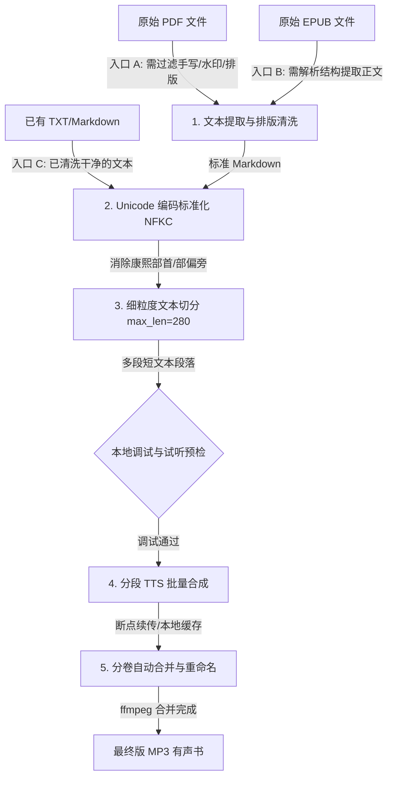

# 文本与 PDF 转高保真有声书（Text/PDF to High-Fidelity Audiobook）

本 Skill 旨在将各种源格式的文档（包括 PDF、TXT、EPUB、Markdown 等）清洗、标准化并转换为无拼写与发音乱码的高保真有声书。该工作流集成了文本提取、中文字符编码标准化、针对大语言模型 TTS 的短切片算法、以及基于 ffmpeg 的多卷自动合并与断点续传控制。

---

## 1. 核心流程与多格式入口

根据您的原始输入格式，选择对应的执行入口：



---

## 2. 详细执行指南

### 阶段零：本地调试与依赖预检（重要！）
* **说明**：在启动大规模批量合成前，必须进行底层依赖检查与单句试听，避免 API Key 配置失效或音色不符合预期导致额度浪费。
* **指南链接**：请务必先查阅 [debugging.md](references/debugging.md) 进行本地预检与 Dry-run。

---

### 阶段一：文本提取与清洗（非必选）
*如果您已拥有干净的 TXT 或 Markdown 文本（入口 C），请直接跳过此阶段，从阶段二开始。*
* **PDF 文本提取**：使用 `PyMuPDF` (`fitz`) 解析 PDF block 字典，通过正文字体白名单过滤手写批注或背景水印。
  * **脚本参考**：[extract_to_markdown.py](scripts/extract_to_markdown.py)
* **EPUB 文本提取**：解析 EPUB 结构，提取出纯文本或标准 Markdown 格式。

---

### 阶段二：Unicode 编码标准化（治愈 TTS 发音乱码）
* **痛点问题**：文档（尤其是经过 OCR 转录的 PDF/EPUB）中许多汉字会被映射到“康熙部首”字符集而非标准 CJK 汉字集，这会导致 TTS 引擎读音及声调错乱。
* **解决方案**：在文本送入 TTS 之前，必须执行 **NFKC 兼容性标准化**：
  ```python
  import unicodedata
  normalized_text = unicodedata.normalize("NFKC", raw_text)
  ```

---

### 阶段三：长文本细粒度切片
* **解决方案**：将单次送入 TTS 的文本长度限制在 **280 字**以内（若为零样本声音克隆 VoiceClone，建议字数限制在 **75-105 字**以内），避免模型因长周期注意力误差引入飘音、电音或语速失控。
* **克隆优化**：关于声音克隆的声音提纯及停顿调优规范，请参考：[voice_clone.md](references/voice_clone.md)

---

### 阶段四：TTS 请求规范与批量合成
* **解决方案**：调用 TTS 引擎进行分段批量合成。
* **接口规范**：以 MiMo TTS 调用格式为例的最佳提示词与 JSON Payload 设计，请参考：[mimo_api.md](references/mimo_api.md)
* **脚本参考**：[generate_audio.py](scripts/generate_audio.py)

---

### 阶段五：分卷自动合并与智能重命名
由于大篇幅合成耗时较长，系统集成了断点续传和自动分卷机制：
* **断点续传**：脚本运行时会自动检测临时分段 MP3 的存在，若存在且体积正常则直接 `skip` 跳过。
* **分卷机制**：默认每生成 30 段音频，无缝调用 `ffmpeg` 进行 Concat 合并生成独立卷，防止中途数据丢失。
  * **合并命令**：
    ```bash
    ffmpeg -y -f concat -safe 0 -i filelist.txt -c copy output.mp3
    ```
* **章节重命名**：调用 `rename_volumes.py` 提取切片 JSON 中的章节标题特征自动重命名，并自动解决重复章节序号。
* **脚本参考**：[rename_volumes.py](scripts/rename_volumes.py)

---

## 3. 错误处理与排查指南

有关网络超时代理设置、API 401 报错、多音字纠偏、以及 ffmpeg 合并损坏文件的处理，请参阅：[troubleshooting.md](references/troubleshooting.md)。

---

## 4. 专属工作空间管理最佳实践

建议在您的项目根目录下创建 `audiobook_workspace/`，统一隔离并归档原始文档、标准电子书、临时分段音频、以及最终合并的 MP3 文件，保持文件结构的干净整洁。
